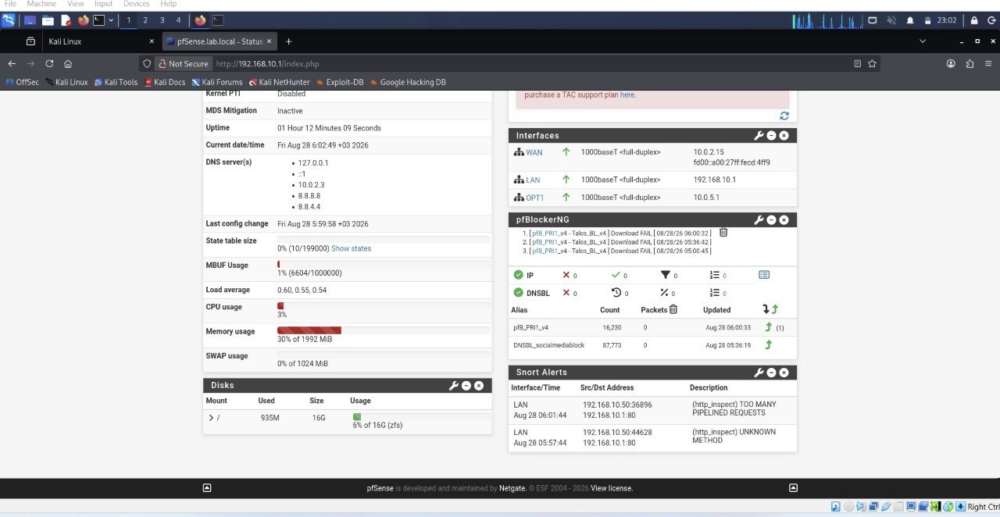
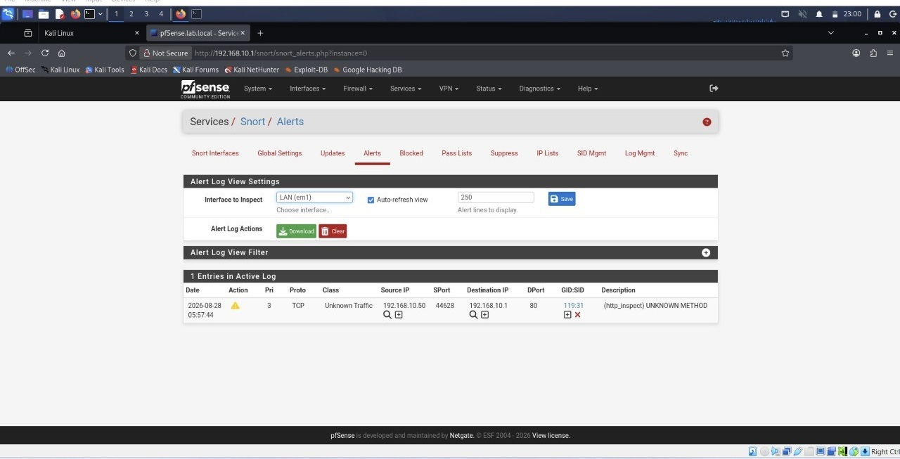

# pfSense-Network-security-Lab
# 🛡️ Enterprise Network Security & IDS/IPS Lab Implementation

A hands-on implementation of an enterprise-grade Virtual Security Lab designed using **pfSense**, **Snort (IDS/IPS)**, and **pfBlockerNG**. This project demonstrates network segmentation, strict firewall access controls, DNS-based content filtering, and real-time intrusion prevention tested via active threat simulation from **Kali Linux**.

---

## 📐 Network Architecture Overview

The lab environment consists of three isolated network zones running on Oracle VirtualBox:

* **WAN Zone:** External facing connection (`10.0.2.15/24`).
* **LAN Zone:** Internal trusted user network (`192.168.10.1/24`).
* **DMZ Zone (OPT1):** Isolated server zone for hosting public services (`10.0.5.1/24`).

---

## 🔑 Key Features & Security Controls

### 1. Network Segmentation & Access Control
* Segmented trust boundaries using separate virtual adapters (Internal Network / NAT).
* Applied strict **Inbound & Outbound Firewall Rules** on the LAN interface adhering to the **Principle of Least Privilege**.

### 2. DNS & Content Filtering (pfBlockerNG)
* Implemented DNS-based blocking (DNSBL) to restrict access to unauthorized platforms (Social Media, Gambling, Malicious Domains).
* Utilized community threat feeds with over **87,000+** domain indicators blocked.

### 3. Intrusion Detection & Prevention (Snort IDS/IPS)
* Deployed **Snort** on the LAN interface for real-time packet inspection.
* Integrated **Snort GPLv2 Community Rules**, **Emerging Threats (ET Open)**, and **FEODO Tracker Botnet C2** feeds.
* Configured automated IP blocking for identified offenders.

---

## 🧪 Threat Simulation & Verification

To test the security posture and verify the effectiveness of the Snort IDS/IPS engine, an active reconnaissance scan was launched from a **Kali Linux attacker machine (`192.168.10.50`)**:

```bash
# Executing aggressive port scan and OS detection targeting pfSense gateway
nmap -A -T5 192.168.10.1
```
### 📊 Verification Results

* **Detection:** Snort captured the incoming malicious pattern (`http_inspect: UNKNOWN METHOD / TOO MANY PIPELINED REQUESTS`).
* **Alert Logging:** Live alerts generated under the Snort Alerts tab specifying the source attacker IP (`192.168.10.50`).
* **Active Mitigation:** Automatic temporary block applied to the attacker IP.


### 🛠️ Tools & Technologies Used
* **Firewall / Router:** pfSense Community Edition
* **IDS/IPS Engine:** Snort
* **Content Filter:** pfBlockerNG
* **Attacker Machine:** Kali Linux
* **Reconnaissance Tool:** Nmap
* **Hypervisor:** Oracle VirtualBox


---

## 📷 Screenshots & Evidence

### pfSense Dashboard


### Snort Real-Time Alerts


